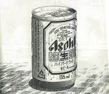
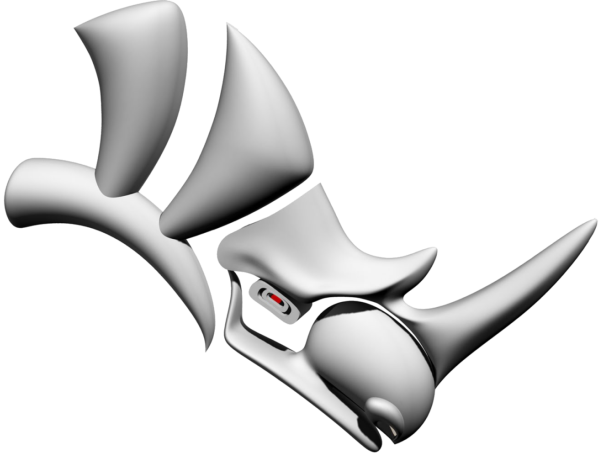
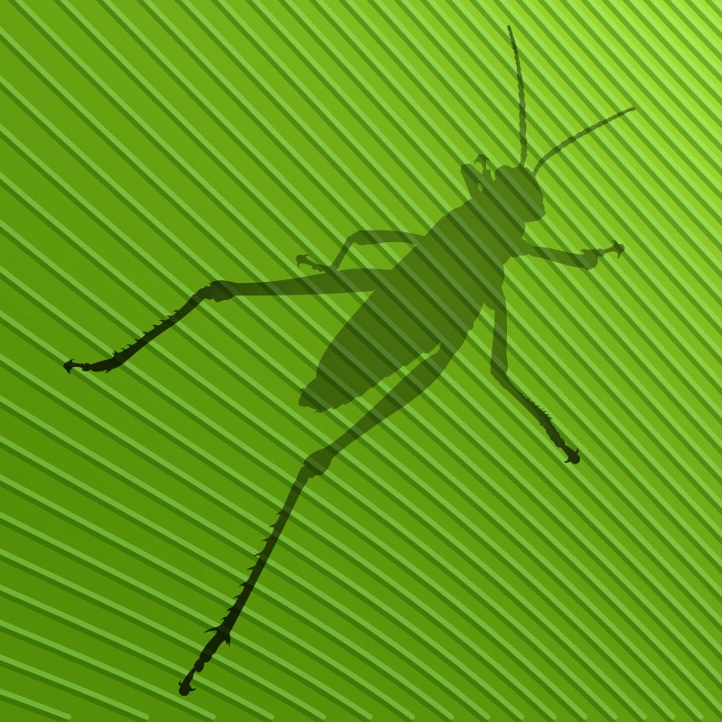
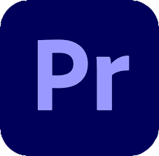
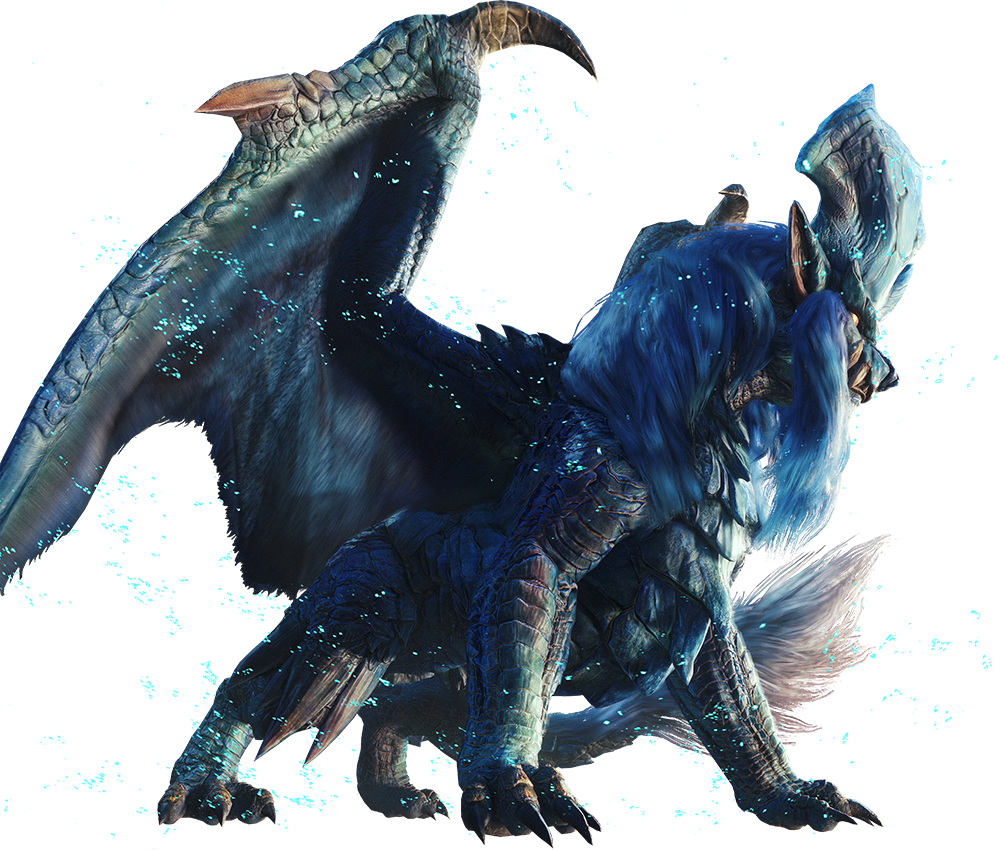
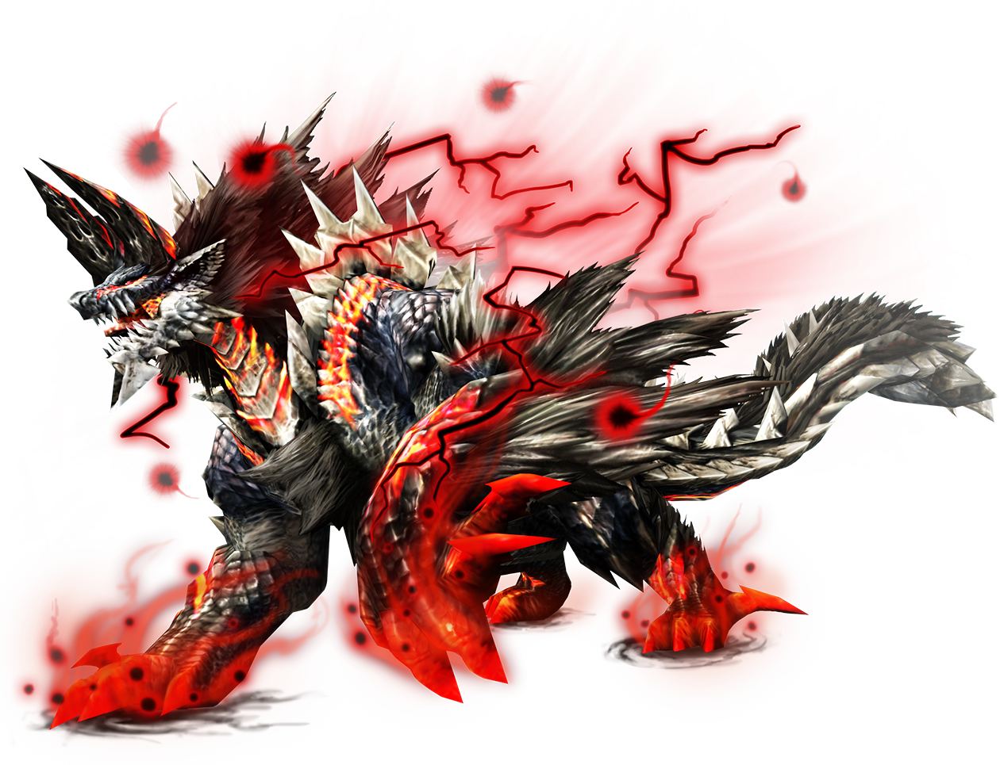

<!-- - 👋 Hi, I’m @Landmaster135
- 👀 I’m interested in ...
- 🌱 I’m currently learning ...
- 💞️ I’m looking to collaborate on ...
- 📫 How to reach me ... -->

<!---
Landmaster135/Landmaster135 is a ✨ special ✨ repository because its `README.md` (this file) appears on your GitHub profile.
You can click the Preview link to take a look at your changes.
--->

<!-- No stylesheet execept github-markdown-css is readable in GitHub -->
<!-- <link href="style/main.css" rel="stylesheet"></link> -->

  
  

  

## Tools

<!--[START IMAGE LIST]-->
  
  
  
  
  
  
  
  
  
  
  
  
  
  
  
  
  
  
  
  
  
  
  
<!--[END IMAGE LIST]-->

## Sub Tools

<!--[START IMAGE LIST]-->
  
  
  
  
  
  
  
  
  
  
  
  
  
  
<!--[END IMAGE LIST]-->

## Recent Posts🐧

<!--[START POSTS LIST]-->
-  [【原神】シュヴァルマラン映影ランド雑記](https://www.endorphinbath.com/genshin-chevalmarin-film-notes-land/)
-  [スプレッドシートじゃなくてDBが欲しい話](https://note.com/kinkinbeer135ml/n/n0d0ae09fd474)
-  [【Go】2025年4月に作った適当開発ツール](https://note.com/kinkinbeer135ml/n/n561ec40b8786)
-  [【Python】Agent Development KitでBrave Search APIのレスポンスを取得する](https://note.com/kinkinbeer135ml/n/nb627265bdb2a)
-  [【Google Cloud】GitHub Actionsで認証するためのシェル関数を作る](https://www.endorphinbath.com/gcp-shell-functions-for-github-actions-authentication/)
-  [【Cloud Scheduler】コンテナを動かすために必要なgcloudコマンドをシェル関数化する](https://www.endorphinbath.com/cloud-scheduler-gcloud-commands-shell-functions/)
-  [【Cloud Run】コンテナを稼働させるまでに必要なgcloudコマンドをシェル関数化する](https://www.endorphinbath.com/cloud-run-gcloud-commands-shell-functions/)
-  [【ffmpeg、PowerShell】MEGAでWebm動画を再生出来るようにする。](https://www.endorphinbath.com/ffmpeg-webm-for-mega-with-powershell/)
-  [【Windows】Claude DesktopでGo製のMCPサーバを使う](https://note.com/kinkinbeer135ml/n/n80598479426d)
-  [この前GoでMCPサーバにいくつかの機能を持たせました](https://note.com/kinkinbeer135ml/n/ndb0d41e595ac)
-  [今年食ったサバ缶をまとめるためのPythonスクリプト](https://www.endorphinbath.com/python-mackerel-of-the-year/)
-  [【YouTubeなど】動画の更新状況_2025年03月](https://www.endorphinbath.com/kinkingame24bit-youtube-202503/)
-  [【Python】死ぬほどモックで沼ってたのでその過程でClaude君が出してくれた対策を並べた](https://www.endorphinbath.com/python-mock-tips-from-claude/)
-  [GeminiのDeep Researchの引用の量がスンゴイですね](https://note.com/kinkinbeer135ml/n/ndcfed25435ab)
-  [本日のキンキンな日記（Go,VSCode,テスト,設計改善）_20250407](https://note.com/kinkinbeer135ml/n/ndb4f2658726e)
<!--[END POSTS LIST]-->

## Blog, SNS🍺

  
  
  
  
  
  
  
  
  

<!-- DECORATION IMAGE -->

<!--[START DECOIMAGE LIST]-->
  <figure style="float:left;">
    
  </figure>
  <figure style="float:left;">
    
  </figure>
  <figure style="float:left;">
    
  </figure>
<!--[END DECOIMAGE LIST]-->

<!-- Metrics -->

  
  

<!-- DECORATION IMAGE -->
<!--[START DECOIMAGE LIST]-->
<figure style="float:none;">
  
</figure>
<!--[END DECOIMAGE LIST]-->
